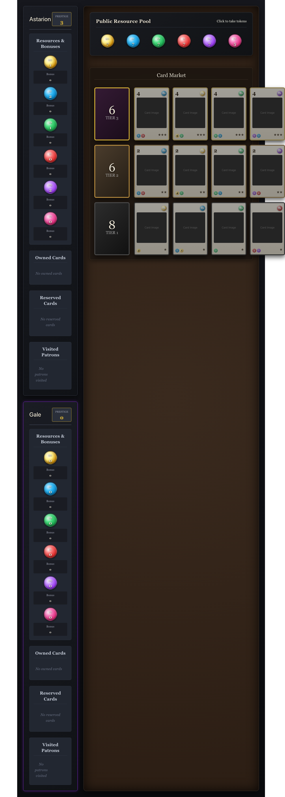
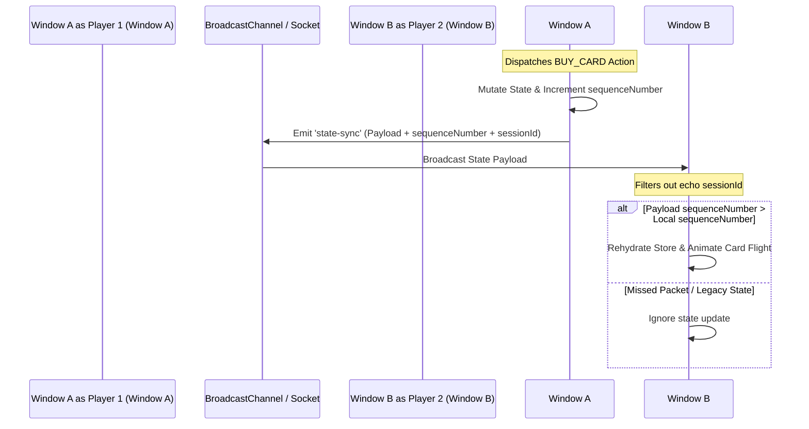

# ⚔️ Baldur's Gate 3: Splendor
> **A high-fidelity digital board game framework reimagined within the dark fantasy universe of Baldur's Gate 3.**

[](https://react.dev/)
[](https://www.typescriptlang.org/)
[](https://vite.dev/)
[](https://github.com/pmndrs/zustand)
[](https://socket.io/)
[](https://vitest.dev/)
[](https://playwright.dev/)

---

## 🌌 Introduction

Welcome to **BG3 Splendor**, an immersive, tactical board game framework combining the elegant engine of the award-winning board game *Splendor* with the rich mechanics, atmosphere, and characters of *Baldur's Gate 3*. 

Gather your party, acquire rare magical resources, buy ancient spells and scrolls, recruit legendary patrons (such as **Elminster**, **Raphael**, or **Volo**), and race to achieve **15 Prestige Points** before your rivals claim victory in the Underdark.



---

## 🏛️ Engineering & Design Philosophy

This project prioritizes **Physical Object Quality** over standard, flat web UI patterns. We treat the browser window not as a document, but as a physical board game arena.

### 1. The Principle of Physicality
*   **Layered Visual Depth**: UI elements are built as stacked, physical entities. Cards, tokens, and boards utilize custom CSS variable layers, HSL tail-end coordinates, and complex multi-tier shadows (`shadow-heavy`) to simulate tangible weight.
*   **Atmospheric Glows**: Interactive elements shine with contextual lighting (e.g., green/golden glows to represent card purchase affordability or action eligibility) which updates in real-time as state mutates.
*   **No Placeholders**: High-fidelity digital illustrations generated via Vertex AI depict rare minerals and spells, keeping the thematic illusion intact.

### 2. Distributed State Synchronization
*   **Zustand Action-Bus**: Centralized state is coordinated via action dispatching. Selectors are subscribed selectively to prevent redundant rendering.
*   **Local Multi-Window Sync**: Built-in support for `BroadcastChannel` APIs allows you to open two separate browser windows locally and play dual-handed with instantaneous state mirroring.
*   **Online Socket Server**: A lightweight Express + Socket.io server powers multiplayer lobbies, handling synchronization via sequence numbering to prevent race conditions and packet loop echoes.

---

## 🎮 Core Game Loop & Features

-   [x] **Full Splendor Mechanics**: 1-to-3 tier spell cards market, automatic refilling decks, and resource limits.
-   [x] **6 Magical Resources**: Collect *Radiant Gems*, *Tadpoles (Wildcards)*, *Infernal Iron*, *Dark Quartz*, *Arcane Crystals*, and *Nature's Blessings*.
-   [x] **Legendary Patrons**: Attract legendary entities like Elminster, Raphael, Volo, and Jergal.
-   [x] **Epic Turn Transitions**: Built-in visual announcer overlay rendering cinema-style banners and floating ember particles for new initiatives.
-   [x] **Music Player Dashboard**: Premium atmospheric soundtrack player with full play/pause/prev/next controls, Fisher-Yates playlist shuffling, and track skip safety limits.
-   [x] **Interactive Staging Area**: Formulate and preview complex token acquisitions or reservation stages before physical confirmation.
-   [x] **Save Slot Profiles**: Choose between 3 independent local storage save slots to maintain parallel campaigns.

---

## 🔌 Multiplayer State Synchronization



---

## 🛠️ Technology Stack

*   **Frontend Core**: React 19, TypeScript 6, Vite 8, TailwindCSS 4
*   **State Management**: Zustand 5 (with selective rendering and localStorage persistence)
*   **Animations**: Framer Motion 12
*   **Audio Core**: Howler.js 2
*   **Backend Sync**: Express 5, Socket.io 4
*   **Testing Suite**: Vitest 4 (Unit), Playwright 1.59 (E2E)

---

## 🚀 Getting Started

### Prerequisites
Make sure you have [Node.js (v22+)](https://nodejs.org/) installed.

### 1. Installation
Clone the repository and install all dependencies:
```bash
npm install
```

### 2. Running Locally (Single-Player / Multi-Window Co-op)
Launch both the multiplayer coordination server and the Vite dev client simultaneously:
```bash
npm start
```
*   **Client URL**: [http://localhost:5173](http://localhost:5173)
*   **Socket Server**: [http://localhost:3000](http://localhost:3000)

*Tip: Open the Client URL in two separate browser windows side-by-side to play multiplayer locally!*

### 3. Running Sanity Checks
Ensure type correctness, linting standards, and all unit tests are green:
```bash
bash tests/sanity/run_checks.sh
```

---

## 🧪 Testing

The codebase includes an extensive testing harness ensuring absolute gameplay rule integrity:

*   **Run Unit Tests**:
    ```bash
    npx vitest run
    ```
*   **Run E2E Integration Tests (Playwright)**:
    ```bash
    npx playwright test tests/e2e/core_loop.spec.ts
    ```

---

## 📜 License
This project is open-source and licensed under the MIT License. Reference or adapt it freely for your non-commercial gaming prototypes!
