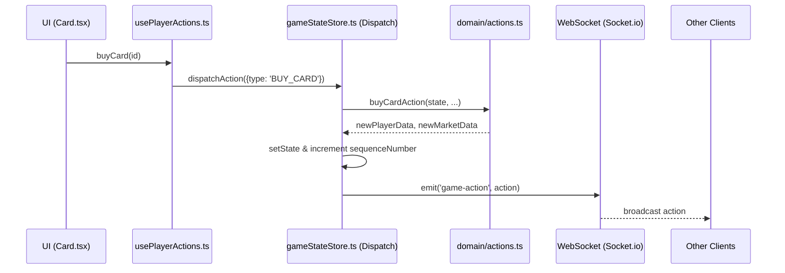

# Data Flow & Event Loop (Action-Bus)

This document describes the modern, Action-Bus driven data flow used in BG3 Splendor. All mutations follow a strict "Intent -> Logic -> Broadcast" cycle.

## 1. The Lifecycle of an Action: "Buy Card"

When a player clicks "Buy" on a card, the data flows through the following chain:

### Step 1: UI Trigger
- **File**: `src/components/features/market/Card.tsx`
- **Action**: User clicks the "Recruit" button.
- **Code**: Calls `handleCardInteract('buy', id)` provided by the `usePlayerActions` hook.

### Step 2: Hook Execution
- **File**: `src/hooks/usePlayerActions.ts`
- **Action**: Directs the intent to the unified store.
- **Code**: Calls `useGameStateStore.getState().dispatchAction({ type: 'BUY_CARD', payload: { ... } })`.

### Step 3: Central Dispatch (The Brain)
- **File**: `src/store/gameStateStore.ts`
- **Action**: The `dispatchAction` function handles the state mutation and networking.
- **Sequence**:
    1. **Domain logic**: Calls pure domain functions (e.g., `buyCardAction` from `src/domain/actions.ts`).
    2. **State Mutation**: Updates the local Zustand state with the result.
    3. **Sequence Increment**: Increments `sequenceNumber` to mark this version.
    4. **Broadcast**: Emits the action via Socket.io to the room.

### Step 4: Network Propagation
- **File**: `src/store/gameStateStore.ts` (socket listener)
- **Action**: Remote clients receive the `game-action`.
- **Logic**: Remote clients run the SAME `dispatchAction` with `isRemote: true`, ensuring deterministic state across the network.

---

## 2. Sequence Diagram

## 3. Resilience Mechanisms

1.  **Strict Sequencing**: If a client receives a full state sync with a lower `sequenceNumber` than its current state, the sync is rejected. This prevents "snapshot echoes" from reverting turns.
2.  **Synced Locks**: UI locks (for animations) are stored in the global state, ensuring all clients are on the same page during cinematic transitions.
